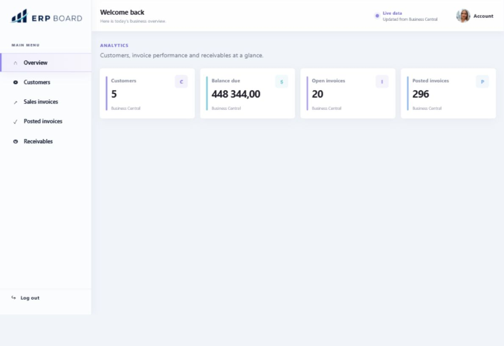
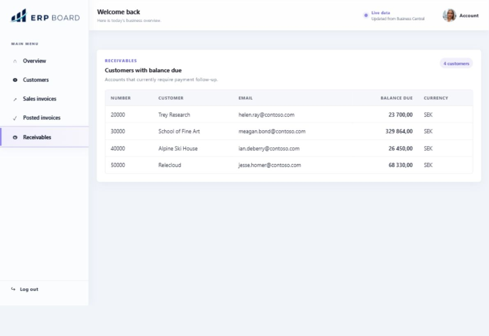

# ERP Dashboard

ERP Dashboard is a full-stack learning project built with Java, Spring Boot, React, and Vite.

The application connects to Microsoft Dynamics 365 Business Central, reads customer and invoice data, and presents KPIs and receivables in a responsive dashboard. It also exposes REST API endpoints for the underlying data and KPI calculations.

Later, the project may grow toward AI-assisted ERP features, such as “Chat with your ERP”.

## Dashboard preview

### Overview



### Customer receivables



## Business Central environment

This project integrates with **Microsoft Dynamics 365 Business Central Online** using the **Business Central REST API v2.0**.

It uses the **CRONUS SE demo company** and its sample data for development, testing, and educational purposes.

No real company or customer data is used.

## Why this project exists

ERP systems contain a lot of important business data, but it is often not easy to access quickly.

From my previous work as an accounting assistant, I know that even simple questions can require manual reports, exports, or checking data in several places.

This project explores how ERP data can be made easier to use through a visual dashboard, clean API endpoints, KPI calculations, and later AI-assisted features like “Chat with your ERP”.

The ERP system remains the source of truth. This application is an extra layer for analytics, search, and future AI functionality.

## Key features

* Integration with Microsoft Dynamics 365 Business Central API
* Automatic OAuth 2.0 client credentials authentication for Business Central
* Google login with OpenID Connect
* Responsive React dashboard with navigation and user profile menu
* KPI overview for customers, sales invoices, and posted sales invoices
* Customer receivables table showing outstanding balances
* REST API endpoints for customers and invoices
* Retry handling for frontend API errors
* Unit and controller tests with JUnit, Mockito, and MockMvc

## Tech stack

### Backend

* Java 21
* Spring Boot 4
* Maven Wrapper
* Spring Security
* Google OpenID Connect
* Microsoft Dynamics 365 Business Central REST API v2.0
* JUnit
* Mockito
* MockMvc
* Bruno

### Frontend

* React 19
* Vite 8
* JavaScript
* CSS
* Oxlint

## Quick start

### 1. Configure the backend

Local secrets are stored in:

```text
backend/src/main/resources/application.properties
```

This file must not be committed to Git.

Required local configuration:

```properties
business-central.tenant=...
business-central.environment=...
business-central.company-id=...
business-central.client-id=...
business-central.client-secret=...

spring.security.oauth2.client.registration.google.client-id=...
spring.security.oauth2.client.registration.google.client-secret=...
spring.security.oauth2.client.registration.google.scope=openid,profile,email
```

### 2. Run the backend

```powershell
cd backend
.\mvnw.cmd spring-boot:run
```

The backend starts at `http://localhost:8080`.

### 3. Run the frontend

In a separate terminal:

```powershell
cd frontend
npm install
npm run dev
```

Open the local URL shown by Vite and log in with Google.

### 4. Run the tests

```powershell
cd backend
.\mvnw.cmd test
```

To check the frontend:

```powershell
cd frontend
npm run lint
npm test
npm run build
```

Additional frontend test commands:

```powershell
# Watch unit, component, and integration tests while developing
npm run test:watch

# Generate an HTML coverage report in frontend/coverage
npm run test:coverage

# Install the E2E browser once, then run the Playwright scenarios
npx playwright install chromium
npm run test:e2e

# Run lint, Vitest, and the production build together
npm run check
```

The frontend tests use Vitest and React Testing Library. API responses are
mocked with MSW, while Playwright verifies the main dashboard flows in Chromium.
They do not require a live backend, Google login, or Business Central connection.

## API endpoints

Authentication and current user:

```text
GET /api/auth/status
GET /api/auth/login-url
GET /api/auth/logout-url
GET /api/me
```

Customers:

```text
GET /api/customers
GET /api/customers/with-balance-due
GET /api/kpi/customers
```

Sales invoices:

```text
GET /api/sales-invoices
GET /api/kpi/sales-invoices
```

Posted sales invoices:

```text
GET /api/posted-sales-invoices
GET /api/kpi/posted-sales-invoices
```

The endpoints can also be tested with Bruno or another API client.

## Ideas to explore next

Possible next steps for this learning project:

* Add a local JSON data source for offline development
* Add more Business Central entities, such as customer ledger entries
* Add aging analysis for customer receivables
* Explore a database data source for structured analytics
* Try a small RAG prototype for ERP-related documents
* Explore how a “Chat with your ERP” feature could work
